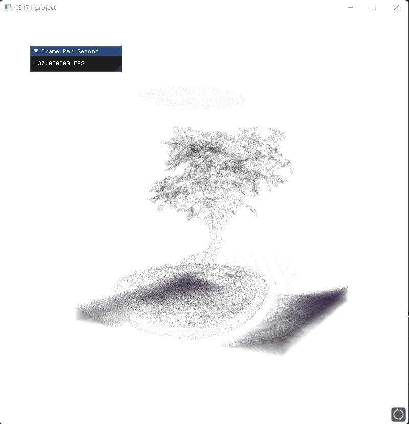

# Volume Renderer using opengl
SHTU CS171 final project

A volume renderer using opengl, raycasting implemented with glsl.

Support for .raw data, under ./data/raw.

Transfer function in ./data/transferfunction, you can also implement your own transfer function.

Recommended using Visual Studio (MSVC) to build this project.

Interaction: Use keyboard WASD, Space, C to move the camera in 6 axis. 

The Camera direction will follow the mouse. 

All .raw data come from [https://klacansky.com/open-scivis-datasets/](https://klacansky.com/open-scivis-datasets/)

Note that the fps will be affected by v-sync, set `glfwSwapInterval(1);` in [utils.cpp](src/utils.cpp) to zero to turn off v-sync if you want to test the extreme speed of this renderer